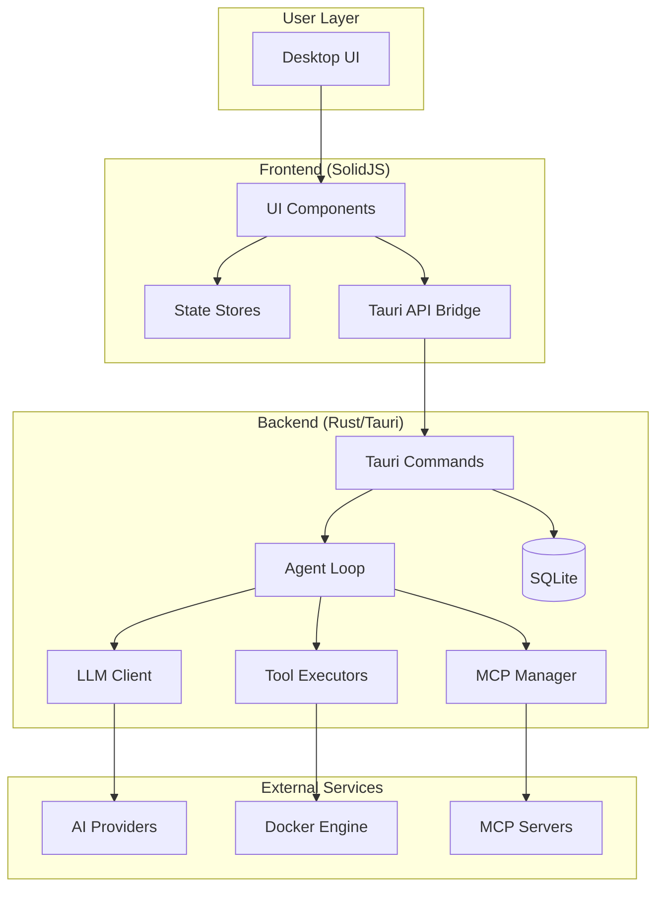
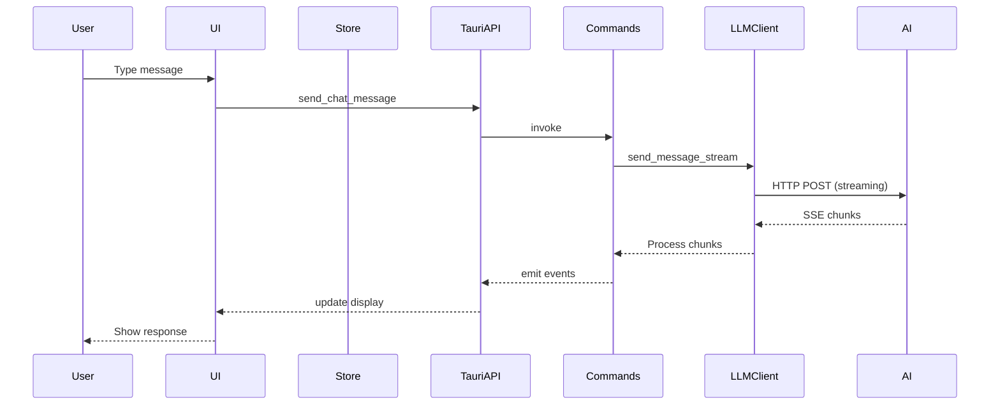
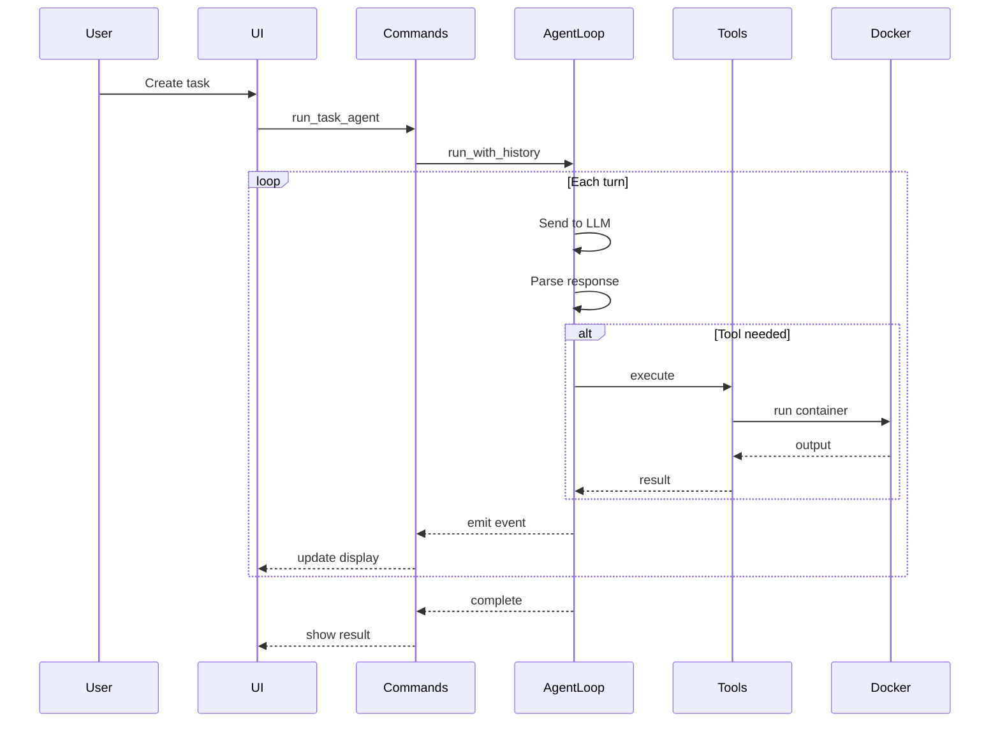

# Architecture Overview

Kuse Cowork is built as a desktop application using modern technologies for both frontend and backend.

## High-Level Architecture



## Technology Stack

### Frontend

| Technology | Purpose |
|------------|---------|
| **SolidJS** | Reactive UI framework |
| **TypeScript** | Type safety |
| **Vite** | Build tool |
| **CSS Modules** | Styling |

### Backend

| Technology | Purpose |
|------------|---------|
| **Rust** | Systems programming |
| **Tauri 2.0** | Desktop framework |
| **Tokio** | Async runtime |
| **SQLite** | Local database |
| **Reqwest** | HTTP client |
| **Bollard** | Docker API |

### Communication

| Layer | Method |
|-------|--------|
| Frontend ↔ Backend | Tauri IPC (invoke/events) |
| Backend ↔ AI | HTTP/HTTPS (REST/SSE) |
| Backend ↔ Docker | Docker API |
| Backend ↔ MCP | HTTP/Stdio |

## Component Overview

### Frontend Components

```
src/
├── App.tsx              # Main app shell
├── components/
│   ├── Chat.tsx         # Chat interface
│   ├── AgentMain.tsx    # Agent execution view
│   ├── TaskPanel.tsx    # Task progress display
│   ├── Settings.tsx     # Configuration panel
│   ├── ModelSelector.tsx # Model picker
│   └── MCPSettings.tsx  # MCP configuration
├── stores/
│   ├── settings.ts      # Settings state
│   └── chat.ts          # Chat state
└── lib/
    ├── tauri-api.ts     # Backend bridge
    ├── ai-client.ts     # Direct AI access
    └── mcp-api.ts       # MCP client
```

### Backend Modules

```
src-tauri/src/
├── main.rs              # Application entry
├── lib.rs               # Library root
├── commands.rs          # Tauri command handlers
├── database.rs          # SQLite operations
├── llm_client.rs        # LLM provider clients
├── agent/
│   ├── mod.rs           # Agent module
│   ├── agent_loop.rs    # Main agent logic
│   ├── message_builder.rs # Request construction
│   ├── tool_executor.rs # Tool execution
│   └── types.rs         # Type definitions
├── tools/
│   ├── mod.rs           # Tools module
│   ├── bash.rs          # Shell execution
│   ├── docker.rs        # Container management
│   ├── file_read.rs     # File reading
│   ├── file_write.rs    # File writing
│   ├── file_edit.rs     # File editing
│   ├── glob.rs          # Pattern matching
│   ├── grep.rs          # Content search
│   └── list_dir.rs      # Directory listing
├── mcp/
│   ├── mod.rs           # MCP module
│   ├── client.rs        # MCP client
│   ├── http_client.rs   # HTTP transport
│   ├── config.rs        # Configuration
│   └── types.rs         # Type definitions
└── skills/
    └── mod.rs           # Skills management
```

## Data Flow

### Chat Message Flow



### Agent Task Flow



## State Management

### Frontend State

State is managed using SolidJS signals and stores:

```typescript
// Settings store
const [settings, setSettings] = createSignal<Settings>(DEFAULT_SETTINGS);

// Chat store
const [messages, setMessages] = createStore<Message[]>([]);
```

### Backend State

State is persisted in SQLite:

```sql
-- Settings table
CREATE TABLE settings (
    key TEXT PRIMARY KEY,
    value TEXT
);

-- Conversations table
CREATE TABLE conversations (
    id TEXT PRIMARY KEY,
    title TEXT,
    created_at INTEGER,
    updated_at INTEGER
);

-- Messages table
CREATE TABLE messages (
    id TEXT PRIMARY KEY,
    conversation_id TEXT,
    role TEXT,
    content TEXT,
    timestamp INTEGER
);
```

## Event System

### Tauri Events

Events flow from backend to frontend:

```rust
// Backend: Emit event
window.emit("chat-event", ChatEvent::Text { content })?;

// Frontend: Listen for event
await listen<ChatEvent>("chat-event", (event) => {
    onEvent(event.payload);
});
```

### Event Types

| Event | Direction | Purpose |
|-------|-----------|---------|
| `chat-stream` | Backend → Frontend | Streaming chat response |
| `chat-event` | Backend → Frontend | Tool execution events |
| `agent-event` | Backend → Frontend | Agent progress updates |

## Security Model

### Isolation Layers

```
┌─────────────────────────────────────┐
│           User Space                │
│  ┌─────────────────────────────┐   │
│  │    Kuse Cowork Process      │   │
│  │  ┌───────────────────────┐  │   │
│  │  │   Docker Container    │  │   │
│  │  │   (Tool Execution)    │  │   │
│  │  └───────────────────────┘  │   │
│  └─────────────────────────────┘   │
└─────────────────────────────────────┘
```

### Data Protection

- **Local Storage**: All data in local SQLite
- **No Telemetry**: No external data transmission
- **API Keys**: Stored locally, passed only to providers
- **Container Isolation**: Commands run in Docker

## Performance Considerations

### Streaming

- SSE for real-time responses
- Incremental UI updates
- Token-by-token display

### Caching

- Model configurations cached
- Connection states maintained
- Context reused across turns

### Resource Management

- Container cleanup after execution
- Connection pooling for HTTP
- Memory-efficient file handling

## Extensibility Points

### Adding Providers

1. Implement in `llm_client.rs`
2. Add format detection
3. Handle authentication
4. Support streaming

### Adding Tools

1. Create in `tools/` directory
2. Register in `tools/mod.rs`
3. Add to agent config
4. Handle in tool executor

### Adding MCP Servers

1. Define server config
2. Implement tool discovery
3. Handle authentication
4. Process tool calls

## Next Steps

- [Frontend Architecture](frontend.md)
- [Backend Architecture](backend.md)
- [Development Setup](../development/setup.md)
