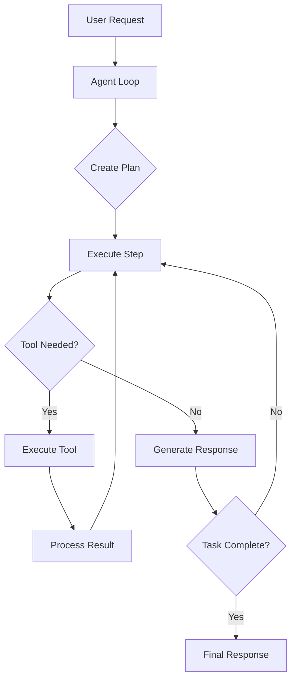

# Agent System

The Kuse Cowork agent is an autonomous AI system that can plan and execute complex tasks using a combination of language models and tools.

## How It Works



## Agent Loop

The agent operates in a loop, processing the task step by step:

1. **Receive Request**: User provides task description and optional project context
2. **Create Plan**: Agent analyzes the request and creates a step-by-step plan
3. **Execute Steps**: Each step is executed, potentially using tools
4. **Track Progress**: Status events are emitted in real-time
5. **Complete**: Final response is generated and saved

### Maximum Turns

The agent has a configurable maximum number of turns (default: 20). Each API call counts as one turn. This prevents infinite loops and runaway costs.

## Planning

When given a task, the agent first creates a structured plan:

```xml
<plan>
1. Read the existing code file
2. Analyze the current implementation
3. Identify areas for improvement
4. Make the necessary edits
5. Verify the changes work
</plan>
```

### Plan Visualization

The UI shows:

- **Step Number**: Current step being executed
- **Description**: What the step aims to accomplish
- **Status**: Pending, In Progress, Completed, or Failed
- **Progress Markers**: `[STEP 1 START]` and `[STEP 1 DONE]`

## Tool Execution

The agent can use various tools to accomplish tasks:

### Available Tools

| Tool | Description | Example Use |
|------|-------------|-------------|
| `read_file` | Read file contents | Understanding existing code |
| `write_file` | Create or overwrite files | Creating new files |
| `edit_file` | Make targeted edits | Modifying existing code |
| `bash` | Run shell commands | Building, testing, git operations |
| `glob` | Find files by pattern | Locating files in a project |
| `grep` | Search file contents | Finding code patterns |
| `list_dir` | List directory contents | Exploring project structure |
| `docker_run` | Run Docker containers | Isolated command execution |

### Tool Selection

The agent automatically selects appropriate tools based on the task:

- **Reading code?** → `read_file`, `glob`, `grep`
- **Making changes?** → `edit_file`, `write_file`
- **Running commands?** → `bash`, `docker_run`
- **Exploring project?** → `list_dir`, `glob`

## Real-time Events

The agent emits events during execution:

### Event Types

| Event | Description |
|-------|-------------|
| `text` | Text content from the agent |
| `plan` | Plan has been created |
| `step_start` | Step execution started |
| `step_done` | Step execution completed |
| `tool_start` | Tool is being executed |
| `tool_end` | Tool execution finished |
| `turn_complete` | API turn completed |
| `done` | Task is complete |
| `error` | An error occurred |

### Event Flow Example

```
[text] I'll help you refactor this code...
[plan] Created 5-step plan
[step_start] Step 1
[tool_start] read_file: src/component.tsx
[tool_end] success
[step_done] Step 1
[step_start] Step 2
[tool_start] edit_file: src/component.tsx
[tool_end] success
[step_done] Step 2
...
[done] Completed in 8 turns
```

## Context Management

### Project Context

When a project folder is selected:

- Files are accessible via tools
- Folder is mounted at `/workspace` in Docker
- Agent understands project structure

### Conversation History

The agent maintains context across turns:

- Previous messages are included in prompts
- Tool results are part of the conversation
- Context helps with follow-up tasks

### Token Management

Long conversations are managed through:

- Context truncation for large files
- Summarization of verbose outputs
- Smart selection of relevant history

## Task Types

### Simple Tasks

Quick, single-step operations:

```
"What's in the package.json file?"
```

Agent: Reads file, provides summary

### Multi-step Tasks

Complex operations requiring planning:

```
"Add a dark mode toggle to the settings page"
```

Agent:
1. Read existing settings component
2. Analyze current styling approach
3. Create theme context/store
4. Add toggle component
5. Update styles
6. Test the implementation

### Iterative Tasks

Tasks requiring back-and-forth:

```
"Let's debug why the tests are failing"
```

Agent:
1. Run tests to see failures
2. Read failing test files
3. Read related source code
4. Identify issues
5. Propose fixes
6. Apply fixes
7. Re-run tests
8. Repeat if needed

## Error Handling

### Graceful Degradation

When tools fail, the agent:

1. Reports the error
2. Attempts alternative approaches
3. Asks for user guidance if stuck

### Common Errors

| Error | Cause | Resolution |
|-------|-------|------------|
| File not found | Wrong path | Check file exists, use glob |
| Permission denied | Access issue | Check permissions |
| Docker error | Container issue | Verify Docker is running |
| API error | Provider issue | Check API key, rate limits |

### Recovery Strategies

- **Retry with different approach**: Try alternative tools or methods
- **Ask for clarification**: Request more specific instructions
- **Report partial progress**: Show what was accomplished before error

## Best Practices

### Writing Effective Prompts

!!! tip "Be Specific"
    ❌ "Fix the bug"
    ✅ "Fix the TypeError in handleSubmit function in src/components/Form.tsx"

!!! tip "Provide Context"
    ❌ "Add authentication"
    ✅ "Add JWT authentication to the /api/users endpoint using the existing auth middleware"

!!! tip "Break Down Complex Tasks"
    ❌ "Build a complete e-commerce site"
    ✅ "Create the product listing component with filtering"

### Optimizing Performance

- **Select project folder**: Enables faster file access
- **Use tool mode**: Enable tools for actionable tasks
- **Provide file paths**: Direct paths are faster than searching

### Working with Large Projects

- Focus on specific directories or files
- Use glob patterns to narrow scope
- Break large refactors into smaller tasks

## System Prompt

The agent uses a system prompt that defines its behavior:

```markdown
You are Kuse Cowork, an AI agent that helps users with
software development tasks.

## IMPORTANT: Always Create a Plan First

Before starting ANY task, you MUST output a plan in this
exact format:

<plan>
1. [First step description]
2. [Second step description]
...
</plan>

## Guidelines
- Always read files before modifying them
- Use edit_file for small changes, write_file for new files
- Be careful with bash commands
- Search with glob and grep before making assumptions
```

### Customization

Future versions may support custom system prompts for:

- Different coding styles
- Specific project conventions
- Domain-specific knowledge

## Advanced Features

### MCP Tool Integration

When MCP servers are connected, additional tools become available:

```
[tool_start] mcp_server_tool_name
[tool_end] success
```

### Skills Integration

Skills extend agent capabilities:

```
"Extract text from document.pdf"

[tool_start] read_file: ~/.kuse-cowork/skills/pdf/SKILL.md
[tool_end] Loaded skill instructions
[tool_start] docker_run: python /skills/pdf/extract.py /workspace/document.pdf
[tool_end] Extracted text content
```

## Limitations

Current limitations of the agent system:

- **Max turns**: 50 turns per task (configurable)
- **Context window**: Limited by model's context length
- **File size**: Large files are truncated
- **Network**: Cannot make arbitrary HTTP requests
- **Interactive**: Cannot handle interactive prompts

## Next Steps

- [Tools Reference](tools.md) - Detailed tool documentation
- [Skills System](skills.md) - Extend agent capabilities
- [MCP Protocol](mcp.md) - Connect external tools
