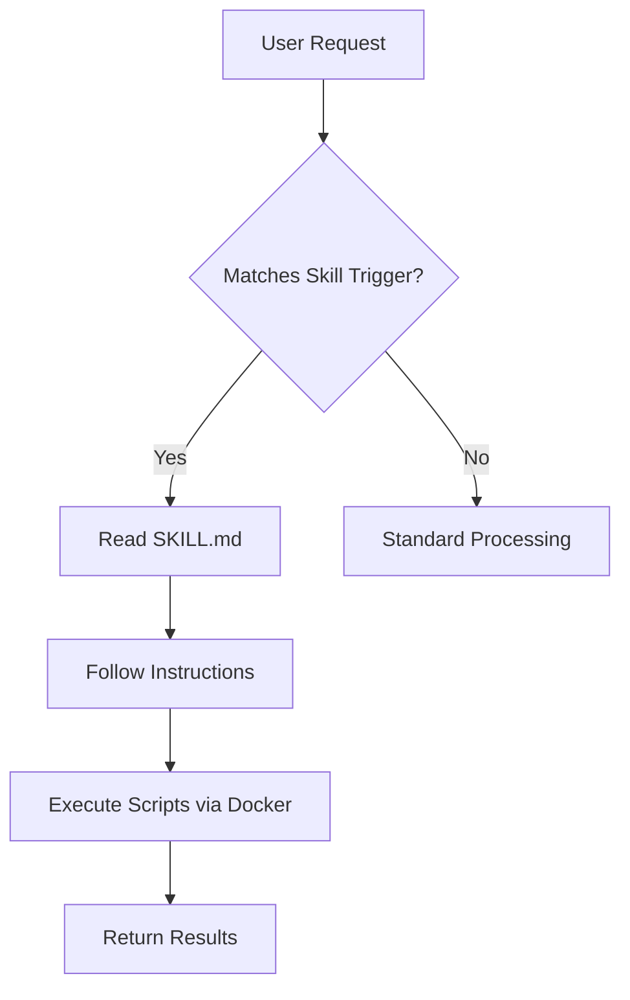

# Skills System

Skills extend the agent's capabilities with specialized processing for specific file types and tasks.

## Overview

Skills are modular extensions that teach the agent how to handle specific tasks:

- **Document Processing**: PDF, DOCX, XLSX, PPTX
- **Data Transformation**: Format conversion, extraction
- **Custom Workflows**: Project-specific automation

## Built-in Skills

Kuse Cowork includes several built-in skills:

### PDF Processing

Extract text and analyze PDF documents.

**Location:** `~/.kuse-cowork/skills/pdf/`

**Capabilities:**
- Extract text content
- Parse tables
- Handle multi-page documents

**Usage:**
```
"Extract the text from report.pdf"
```

### DOCX Processing

Work with Microsoft Word documents.

**Location:** `~/.kuse-cowork/skills/docx/`

**Capabilities:**
- Extract text content
- Preserve formatting info
- Handle embedded images (metadata)

**Usage:**
```
"Summarize the content of proposal.docx"
```

### XLSX Processing

Process Excel spreadsheets.

**Location:** `~/.kuse-cowork/skills/xlsx/`

**Capabilities:**
- Read cell data
- Parse multiple sheets
- Handle formulas (values)

**Usage:**
```
"Analyze the data in sales.xlsx"
```

### PPTX Processing

Handle PowerPoint presentations.

**Location:** `~/.kuse-cowork/skills/pptx/`

**Capabilities:**
- Extract slide text
- Read speaker notes
- Parse slide structure

**Usage:**
```
"Create an outline from presentation.pptx"
```

## Skill Structure

Each skill follows a standard structure:

```
~/.kuse-cowork/skills/
└── my-skill/
    ├── SKILL.md        # Skill definition and instructions
    ├── forms.md        # Optional: Input forms
    ├── reference.md    # Optional: Additional documentation
    └── scripts/        # Optional: Executable scripts
        ├── process.py
        └── convert.sh
```

### SKILL.md Format

The main skill definition file:

```markdown
# My Custom Skill

A brief description of what this skill does.

## Trigger

Keywords or patterns that activate this skill:
- "convert to X"
- "process Y file"

## Instructions

When activated, follow these steps:

1. Read the input file using read_file
2. Run the processing script: `python /skills/my-skill/scripts/process.py`
3. Return the output to the user

## Parameters

- **input_file**: Path to the file to process
- **output_format**: Desired output format

## Examples

### Example 1: Basic Usage
Input: "Process document.pdf"
Action: Run extraction script and return text

### Example 2: With Options
Input: "Process document.pdf as markdown"
Action: Run extraction with markdown formatting
```

## Creating Custom Skills

### Step 1: Create Skill Directory

```bash
mkdir -p ~/.kuse-cowork/skills/my-skill/scripts
```

### Step 2: Write SKILL.md

```markdown
# CSV to JSON Converter

Converts CSV files to JSON format.

## Trigger
- "convert csv to json"
- "csv to json"

## Instructions

1. Read the CSV file path from user input
2. Run: `python /skills/csv-converter/scripts/convert.py <input_file>`
3. Return the JSON output

## Parameters
- **input_file**: Path to the CSV file
- **pretty**: Whether to format output (default: true)
```

### Step 3: Create Scripts

```python title="scripts/convert.py"
#!/usr/bin/env python3
import csv
import json
import sys

def convert(input_file):
    with open(input_file, 'r') as f:
        reader = csv.DictReader(f)
        data = list(reader)
    return json.dumps(data, indent=2)

if __name__ == '__main__':
    if len(sys.argv) < 2:
        print("Usage: convert.py <input_file>")
        sys.exit(1)
    print(convert(sys.argv[1]))
```

### Step 4: Test the Skill

```
User: "Convert data.csv to JSON"

Agent:
[Reading skill definition]
[Running: python /skills/csv-converter/scripts/convert.py /workspace/data.csv]
[Returning JSON output]
```

## Skill Discovery

The agent discovers skills through:

1. **System Prompt**: Skills directory is mentioned in the system prompt
2. **Automatic Mounting**: Skills are mounted at `/skills` in Docker
3. **SKILL.md Parsing**: Agent reads skill definitions when needed

### Skill Loading Flow



## Advanced Skill Features

### Dependencies

Skills can specify required packages:

```markdown
## Dependencies

Python packages (installed in container):
- pandas
- openpyxl

Install command:
`pip install pandas openpyxl`
```

### Multi-Step Processing

Skills can define complex workflows:

```markdown
## Instructions

### Step 1: Extract
Run: `python /skills/doc-processor/scripts/extract.py <input>`

### Step 2: Transform
Run: `python /skills/doc-processor/scripts/transform.py <extracted_data>`

### Step 3: Format
Run: `python /skills/doc-processor/scripts/format.py <transformed_data>`
```

### Error Handling

Skills can specify error handling:

```markdown
## Error Handling

If extraction fails:
1. Check file format is supported
2. Try alternative extraction method
3. Report specific error to user
```

## Skill Best Practices

### Design Guidelines

::: tip Single Responsibility
    Each skill should do one thing well.

::: tip Clear Triggers
    Define specific, unambiguous trigger phrases.

::: tip Detailed Instructions
    Provide step-by-step instructions the agent can follow.

### Script Guidelines

::: tip Standalone Scripts
    Scripts should work independently with clear input/output.

::: tip Error Messages
    Provide helpful error messages for common issues.

::: tip Standard I/O
    Use stdin/stdout for data flow when possible.

### Documentation

::: tip Include Examples
    Show concrete examples of skill usage.

::: tip Document Parameters
    List all parameters with descriptions and defaults.

## Skill Locations

### Default Skills

```
~/.kuse-cowork/skills/
├── pdf/
├── docx/
├── xlsx/
└── pptx/
```

### Custom Skills

Add custom skills in the same directory:

```
~/.kuse-cowork/skills/
├── pdf/
├── docx/
├── xlsx/
├── pptx/
├── my-custom-skill/
└── another-skill/
```

### Docker Access

All skills are mounted at `/skills` in containers:

```bash
# In Docker container
ls /skills/
# Output: pdf docx xlsx pptx my-custom-skill another-skill
```

## Sharing Skills

### Export a Skill

```bash
cd ~/.kuse-cowork/skills
zip -r my-skill.zip my-skill/
```

### Import a Skill

```bash
cd ~/.kuse-cowork/skills
unzip my-skill.zip
```

### Community Skills

Future versions may support:
- Skill marketplace
- One-click installation
- Version management

## Troubleshooting

### Skill not detected

    1. Verify SKILL.md exists in skill directory
    2. Check skill directory is in `~/.kuse-cowork/skills/`
    3. Restart Kuse Cowork

### Script fails to run

    1. Check script has execute permissions
    2. Verify shebang line (`#!/usr/bin/env python3`)
    3. Test script manually in Docker

### Dependencies not found

    1. Install deps in Docker: `docker_run pip install <package>`
    2. Add installation to script
    3. Use custom Docker image with deps

## Next Steps

- [Tools Reference](tools.md) - Built-in tools
- [Agent System](agent.md) - How skills are used
- [Development Guide](../development/setup.md) - Contributing skills
