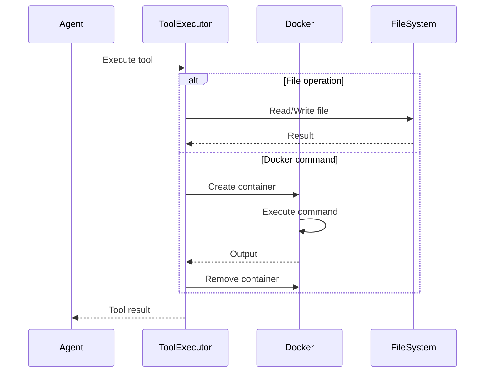

# Tools Reference

Tools are the building blocks that allow the Kuse Cowork agent to interact with your system and codebase.

## Overview

The agent can use tools to:

- Read and modify files
- Execute shell commands
- Search and navigate codebases
- Run code in isolated containers

## File Operations

### read_file

Read the contents of a file.

**Parameters:**

| Parameter | Type | Required | Description |
|-----------|------|----------|-------------|
| `path` | string | Yes | Path to the file |

**Example:**

```json
{
  "name": "read_file",
  "input": {
    "path": "src/components/Button.tsx"
  }
}
```

**Features:**

- Supports `~` expansion for home directory
- Handles large files with truncation
- Returns line numbers for easy reference

---

### write_file

Create or overwrite a file.

**Parameters:**

| Parameter | Type | Required | Description |
|-----------|------|----------|-------------|
| `path` | string | Yes | Path to the file |
| `content` | string | Yes | Content to write |

**Example:**

```json
{
  "name": "write_file",
  "input": {
    "path": "src/utils/helpers.ts",
    "content": "export function helper() {\n  return true;\n}"
  }
}
```

**Features:**

- Creates parent directories if needed
- Overwrites existing files
- Supports any text content

---

### edit_file

Make targeted edits to an existing file.

**Parameters:**

| Parameter | Type | Required | Description |
|-----------|------|----------|-------------|
| `path` | string | Yes | Path to the file |
| `old_content` | string | Yes | Text to find and replace |
| `new_content` | string | Yes | Replacement text |

**Example:**

```json
{
  "name": "edit_file",
  "input": {
    "path": "src/config.ts",
    "old_content": "const DEBUG = false;",
    "new_content": "const DEBUG = true;"
  }
}
```

**Features:**

- Precise search-and-replace
- Preserves file formatting
- Supports multi-line edits
- Reports if match not found

---

### list_dir

List contents of a directory.

**Parameters:**

| Parameter | Type | Required | Description |
|-----------|------|----------|-------------|
| `path` | string | Yes | Directory path |

**Example:**

```json
{
  "name": "list_dir",
  "input": {
    "path": "src/components"
  }
}
```

**Output:**

```
Button.tsx
Card.tsx
Modal/
  index.tsx
  styles.css
```

## Search Operations

### glob

Find files matching a pattern.

**Parameters:**

| Parameter | Type | Required | Description |
|-----------|------|----------|-------------|
| `pattern` | string | Yes | Glob pattern |
| `path` | string | No | Base directory (default: project root) |

**Example:**

```json
{
  "name": "glob",
  "input": {
    "pattern": "**/*.test.ts",
    "path": "src"
  }
}
```

**Pattern Examples:**

| Pattern | Matches |
|---------|---------|
| `*.ts` | TypeScript files in current dir |
| `**/*.ts` | All TypeScript files recursively |
| `src/**/*.{ts,tsx}` | TS/TSX files in src |
| `!**/node_modules/**` | Exclude node_modules |

---

### grep

Search file contents.

**Parameters:**

| Parameter | Type | Required | Description |
|-----------|------|----------|-------------|
| `pattern` | string | Yes | Regex pattern to search |
| `path` | string | No | Directory or file to search |
| `include` | string | No | File pattern to include |

**Example:**

```json
{
  "name": "grep",
  "input": {
    "pattern": "function handleSubmit",
    "path": "src",
    "include": "*.tsx"
  }
}
```

**Output:**

```
src/components/Form.tsx:45: function handleSubmit(event) {
src/components/Login.tsx:23: function handleSubmit() {
```

## Command Execution

### bash

Execute shell commands.

**Parameters:**

| Parameter | Type | Required | Description |
|-----------|------|----------|-------------|
| `command` | string | Yes | Command to execute |
| `cwd` | string | No | Working directory |

**Example:**

```json
{
  "name": "bash",
  "input": {
    "command": "npm test -- --coverage",
    "cwd": "/workspace"
  }
}
```

**Features:**

- Runs in project context
- Captures stdout and stderr
- Has timeout protection
- Returns exit code

!!! warning "Security"
    Commands run on your local system. Be cautious with destructive commands.

---

### docker_run

Run commands in Docker containers.

**Parameters:**

| Parameter | Type | Required | Description |
|-----------|------|----------|-------------|
| `command` | string | Yes | Command to run |
| `image` | string | No | Docker image (default: python:3.11-alpine) |
| `workdir` | string | No | Working directory (default: /workspace) |

**Example:**

```json
{
  "name": "docker_run",
  "input": {
    "command": "python script.py",
    "image": "python:3.11-alpine",
    "workdir": "/workspace"
  }
}
```

**Available Images:**

| Image | Use Case |
|-------|----------|
| `python:3.11-alpine` | Python scripts (default) |
| `node:20` | Node.js scripts |
| `ubuntu:latest` | General purpose |
| `rust:alpine` | Rust compilation |

**Mount Points:**

| Host Path | Container Path | Access |
|-----------|----------------|--------|
| Project folder | `/workspace` | Read/Write |
| Skills directory | `/skills` | Read-only |

---

### docker_list

List running Docker containers.

**Parameters:** None

**Example:**

```json
{
  "name": "docker_list",
  "input": {}
}
```

---

### docker_images

List available Docker images.

**Parameters:** None

**Example:**

```json
{
  "name": "docker_images",
  "input": {}
}
```

## MCP Tools

When MCP servers are connected, additional tools become available dynamically:

```json
{
  "name": "mcp_servername_toolname",
  "input": {
    "param1": "value1"
  }
}
```

See [MCP Protocol](mcp.md) for details.

## Tool Execution Flow



## Error Handling

### Common Errors

| Error | Cause | Solution |
|-------|-------|----------|
| `File not found` | Invalid path | Check path with `list_dir` or `glob` |
| `Permission denied` | Access restricted | Check file permissions |
| `Container failed` | Docker issue | Verify Docker is running |
| `Match not found` | Edit target missing | Verify exact match exists |
| `Timeout` | Long-running command | Break into smaller operations |

### Error Response Format

```json
{
  "tool_use_id": "tool_123",
  "content": "Error: File not found: /path/to/file.txt",
  "is_error": true
}
```

## Best Practices

### File Operations

!!! tip "Read Before Edit"
    Always read a file before editing to understand its current state.

!!! tip "Use Exact Matches"
    For `edit_file`, use the exact text including whitespace.

!!! tip "Prefer edit_file"
    Use `edit_file` for modifications, `write_file` only for new files.

### Search Operations

!!! tip "Start Broad"
    Use `glob` to find files, then `grep` to search within them.

!!! tip "Use Specific Patterns"
    More specific patterns are faster and produce fewer results.

### Command Execution

!!! tip "Prefer Docker"
    Use `docker_run` for risky or experimental commands.

!!! tip "Check Exit Codes"
    Tool results include exit codes for command success/failure.

### Performance

!!! tip "Batch Operations"
    Combine related operations to reduce API calls.

!!! tip "Use Working Directory"
    Set `cwd` to avoid long absolute paths.

## Tool Configuration

### Allowed Tools

Tools can be restricted per task:

```rust
AgentConfig {
    allowed_tools: vec![
        "read_file".to_string(),
        "glob".to_string(),
        "grep".to_string(),
    ],
}
```

### Docker Settings

Container resource limits:

- **Memory**: Default unlimited
- **CPU**: Default unlimited
- **Timeout**: 5 minutes per command
- **Network**: Host network by default

## Next Steps

- [Skills System](skills.md) - Extend tool capabilities
- [Agent System](agent.md) - How tools are orchestrated
- [MCP Protocol](mcp.md) - Add external tools
