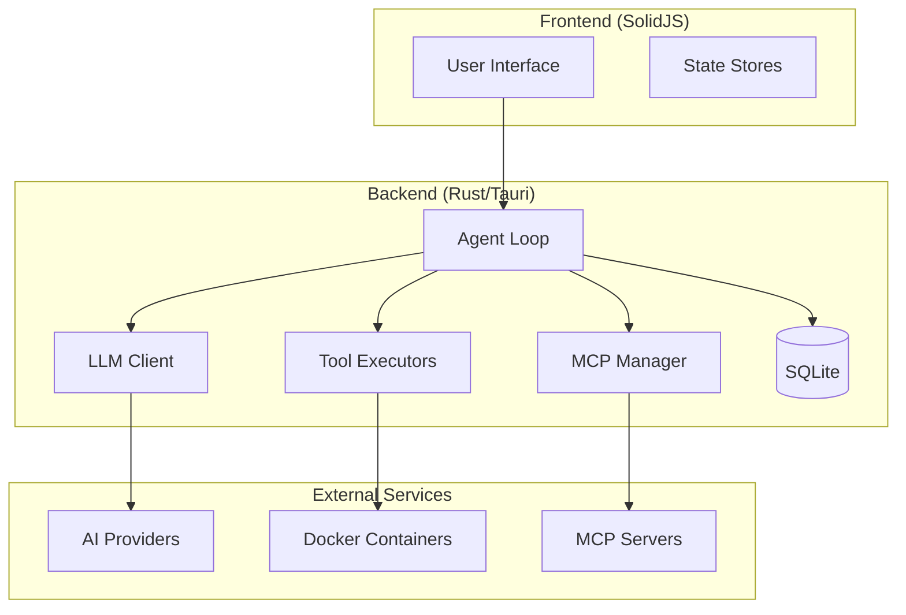

# Kuse Cowork

<div align="center">
  <h3>Open-source AI Agent Framework for Desktop</h3>
  <p>A cross-platform desktop application that brings AI agent capabilities to your local machine with complete privacy control.</p>
</div>

---

## What is Kuse Cowork?

Kuse Cowork is an open-source, cross-platform desktop application that functions as an AI agent framework. It's designed as an alternative to cloud-based AI assistants, allowing users to leverage AI agents for software development and productivity tasks with **complete privacy control** through BYOK (Bring Your Own Key) integration.

The agent can:

- :material-file-document: Read and write files
- :material-console: Execute commands in isolated Docker containers
- :material-magnify: Search and navigate codebases
- :material-puzzle: Access extended tools through MCP protocol
- :material-brain: Plan and execute multi-step tasks autonomously

## Key Features

<div class="grid cards" markdown>

-   :material-cloud-outline:{ .lg .middle } **Multi-Provider Support**

    ---

    Connect to Anthropic Claude, OpenAI GPT, Google Gemini, local models (Ollama), and more.

    [:octicons-arrow-right-24: Learn more](features/providers.md)

-   :material-robot:{ .lg .middle } **Autonomous Agent**

    ---

    AI agent that plans and executes tasks step-by-step with real-time progress tracking.

    [:octicons-arrow-right-24: Learn more](features/agent.md)

-   :material-docker:{ .lg .middle } **Secure Isolation**

    ---

    Commands execute in Docker containers, keeping your system safe from unintended changes.

    [:octicons-arrow-right-24: Learn more](features/tools.md)

-   :material-puzzle:{ .lg .middle } **Extensible Skills**

    ---

    Built-in skills for PDF, DOCX, XLSX processing, with support for custom skill development.

    [:octicons-arrow-right-24: Learn more](features/skills.md)

</div>

## Quick Start

=== "macOS"

    ```bash
    # Download from GitHub Releases
    # Or build from source:
    git clone https://github.com/kuse-cowork/kuse_cowork.git
    cd kuse_cowork
    pnpm install
    pnpm tauri build
    ```

=== "Windows"

    ```bash
    # Download from GitHub Releases
    # Or build from source:
    git clone https://github.com/kuse-cowork/kuse_cowork.git
    cd kuse_cowork
    pnpm install
    pnpm tauri build
    ```

=== "Linux"

    ```bash
    # Download from GitHub Releases
    # Or build from source:
    git clone https://github.com/kuse-cowork/kuse_cowork.git
    cd kuse_cowork
    pnpm install
    pnpm tauri build
    ```

## Why Kuse Cowork?

| Feature | Kuse Cowork | Cloud AI Assistants |
|---------|-------------|---------------------|
| **Privacy** | All data stays local | Data sent to cloud |
| **API Keys** | BYOK - you own your keys | Platform-managed |
| **Offline** | Works with local models | Requires internet |
| **Extensible** | Custom skills & MCP | Limited customization |
| **Open Source** | Fully transparent | Closed source |

## Architecture



## Community

- :fontawesome-brands-github: [GitHub Repository](https://github.com/kuse-cowork/kuse_cowork)
- :material-bug: [Issue Tracker](https://github.com/kuse-cowork/kuse_cowork/issues)
- :material-file-document: [Contributing Guide](development/contributing.md)

## License

Kuse Cowork is released under the MIT License. See [LICENSE](https://github.com/kuse-cowork/kuse_cowork/blob/main/LICENSE) for details.
